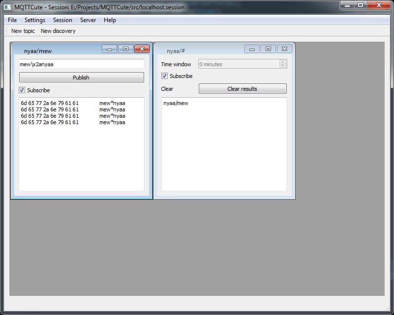

# MQTTCute #

**Author:** Maya Posch

**Revised:** 2019/09/22

## Overview ##

MQTTCute is an MQTT desktop client written in C++/Qt. Its main focus is on being helpful with the debugging and monitoring of MQTT-based systems which use binary protocols.

## Installing ##

For 64-bit Windows a binary installer is provided. See the [releases page](https://github.com/MayaPosch/MQTTCute/releases) for this project for a download link. This version should work on Windows 7 and up:

* [MQTTCute_installer.exe](https://github.com/MayaPosch/MQTTCute/releases/download/v0.3-alpha/MQTTCute_installer.exe)

A Linux (x64) binary is also available, make sure you have installed Qt5 ('qt5-default' on Ubuntu) and LibPoco ('libpoco-dev' on Ubuntu) before launching the binary:

* [MQTTCute_0.3a.bz2](https://github.com/MayaPosch/MQTTCute/releases/download/v0.3-alpha/MQTTCute_0.3a.bz2)

## Building ##

Starting recently, the new [NymphMQTT](https://github.com/MayaPosch/NymphMQTT) library has been integrated into MQTTCute, replacing the libmosquitto dependency. To use libmosquitto instead, edit the project file and follow the old build instructions.

The full list of dependencies is:

* Qt 5.x.
* POCO.
* [NymphMQTT](https://github.com/MayaPosch/NymphMQTT).
* [ByteBauble](https://github.com/MayaPosch/ByteBauble).

One can build the project using the Qt Creator IDE, or from the command line when in the project root:

	$ mkdir build
	$ cd build
	$ qmake ..
	$ make

This will build the debug version in a `debug` sub-folder. To build the release version into the `release` folder, replace the `make` command with:
	
	$ make release

## Building (old) ##

This application should compile and run on any platform which is supported by the Qt 5.x framework and has the Mosquitto client libraries (libmosquitto, libmosquittopp) available for them.

So far MQTTCute has been built and tested on the following platforms:

* Windows 7 Ultimate x64, MSVC 2017 x64.
* Windows 7 Ultimate x64, MinGW 7.x/8.x x86
* Linux Mint 18.x x64, GCC 5.x

On Ubuntu and similar distributions, install the libmosquittopp-dev package. On Windows, for 64-bit MSVC (2017, possibly 2015), the required library and DLL files are included in the source tree. 

For other (32-bit) MSVC versions, get the binary files from the Mosquitto website at: https://mosquitto.org/download/

For MinGW, the build system will use the modified Mosquitto library sources that are included in the project and not require any external dependencies.

With all dependencies fulfilled, simply perform `qmake` and `make` on the command line, or use the Qt Creator IDE to open and compile the project. For 64-bit MSVC, copy the provided (under `mosquitto/msvc_2017_x64`) DLLs to a location where they can be found by Windows.

## Usage ##

After compiling the application, it can simply be started. Once the UI opens, one would use the 'Server' menu option to connect to an MQTT broker. Fill out the required information in the dialogues that appear and the connection should be established.

In order to **publish** on a topic, use the 'New topic' toolbar option and provide the topic name. A sub-window opens in which one can write down the text one wishes to publish. In order to publish binary data, one would write it in hexadecimal format, following the GNU 'echo' style format:

`\xXX`

Hereby the last two characters would be the hexadecimal value, forming a single byte. Unlike with 'echo', it is always required to use two characters. Use a '0' as the first character if only the second character is non-zero. Also see the above screenshot for a demonstration.

In order to **subscribe** to a topic, follow the same procedure as above to create a new topic window if a window with that topic doesn't exist yet. After this, simply enable the 'Subscribe' checkbox on the window. One will now receive any messages published on this topic.

The received messages will be displayed twice, once in hexadecimal format on the left side, then in text format on the right side.

To **discover** active topics underneath a category, use the `New discovery' toolbar option and fill in a topic that ends with an MQTT wildcard topic ('/#'). In the window that appears one can then check 'subscribe' and the text field will be filled with all active topics on which are currently being published.

Use the menu options underneath **Session** to load sessions and create new ones. Currently sessions do not yet save open windows.

## TODO ##

* Better and customisable received message formatting and copying.
* History function and loading of external files for publishing.
* Save open window state in session files.
* Encrypt usernames and passwords for MQTT brokers in session files.

## Donate ##

If you like the application and find it useful, you can [donate](http://mayaposch.com/donate.php) any amount.
